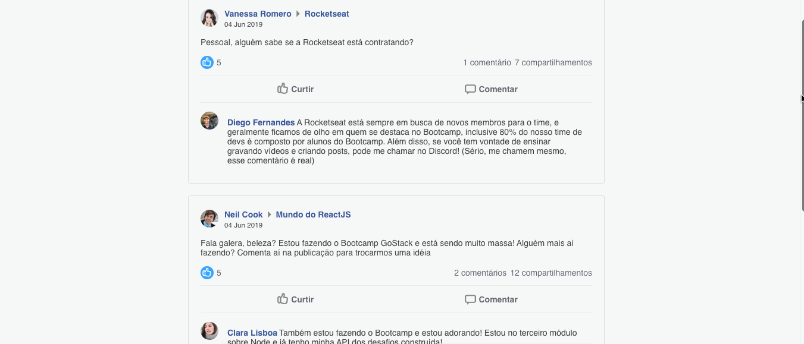

<h1 style="text-align:"center";">Facebook-Flexbox-React</h1>

#### :rocket: Como instalar
- $ git clone https://github.com/jonabf1/facebook-ui-concept-flexbox-react
- Vá para a pasta do repositorio
- yarn install (instalar todas as dependências)
- webpack --mode development (gerar o build)
- webpack-dev-server --mode development (iniciar a aplicação)

#### Dependência usadas
- @babel/plugin-proposal-class-properties
- css-loader
- prop-types
- react
- react-dom
- react-icons
- style-loader
- styled-components
    
#### 4. Resultado final

---

Made with ♥ by [Jonathan](https://www.linkedin.com/in/jonathan-barros-franco)

